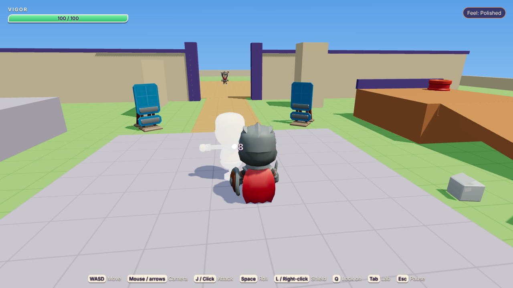

# Island Blade

A small 3D action-adventure in the browser: the real-time counterpart of
Island RPG, built on Three.js and Rapier. Its showcase is a **game-feel
lab**: a panel beside the fight where you switch individual game-feel
techniques on and off (hit-stop, input buffering, i-frames, camera
smoothing, telegraphs...) and feel why each one exists.

**Status:** session 1 of 2, a playable combat sandbox. A knight with a
three-hit sword combo, a roll with invulnerability frames, a shield and
lock-on; three sword-and-shield grunts with telegraphed attacks; a training
dummy that shows damage numbers; and the lab. Session 2 adds the island
village, a short dungeon, NPCs, dialogue, quests and saving.

**Play it:** <https://rdbagwell.github.io/3D_Game/> (once Pages is switched on;
see below). Add `?lab` to open the lab straight away.

- [docs/GAME-FEEL.md](docs/GAME-FEEL.md): every game-feel technique, how it's done here, and its trade-offs
- [docs/ENGINE.md](docs/ENGINE.md): how the engine works, with how-tos
- [docs/BLENDER.md](docs/BLENDER.md): building levels in Blender, no code needed
- [docs/PERFORMANCE.md](docs/PERFORMANCE.md): the budget, what was measured and how to measure on real devices
- [ASSETS.md](ASSETS.md): where every asset came from (read before publishing anything)
- [docs/ASSETS-TODO.md](docs/ASSETS-TODO.md): music and downloads still to come



## Run it

You need [Node.js](https://nodejs.org/) 20.19 or newer.

```sh
npm install
npm run dev          # open the printed http://localhost:5173 link
```

| Command | What it does |
| --- | --- |
| `npm run dev` | Development server with live reload |
| `npm test` | Type check (`tsc --noEmit` over the JSDoc types), then the unit tests |
| `npm run build` | Production build in `dist/` (relative paths: works in any folder) |
| `npm run preview` | Serve the last build |
| `npm run test:e2e` | Playwright smoke tests against the build (run `npm run build` first) |
| `npm run screenshots` | Regenerate `docs/screenshots/` (after `npm run build`) |
| `npm run assets` | Optimise downloaded asset packs from `art/incoming/` into `public/` (see docs/ASSETS-TODO.md) |

## Put it online (GitHub Pages)

`.github/workflows/pages.yml` tests and builds every push, and deploys
`main` to GitHub Pages. One-time setup:

1. **Settings → Pages → Build and deployment → Source: GitHub Actions.**
2. Merge to `main` (or run the workflow by hand from the Actions tab).
3. The game is at <https://rdbagwell.github.io/3D_Game/>. The repository name
   is case-sensitive in that address. The build uses relative paths, so
   renaming the repository only changes the address: update `repo` in
   `site.config.js` and the links in this file (a test checks they agree).

## How to play

You start in the training grounds facing a training dummy. Hit it, then open
the lab (**Tab**) and press **Raw** to feel the difference. Through the gate
to the north, three grunts wait in the arena. Watch for the wind-up (a
shrinking ring, a "!" sign, a glowing blade and a rising whine): roll through
the blow, or block it from the front, then punish the recovery.

| Action | Keyboard and mouse | Gamepad (standard layout) | Touch |
| --- | --- | --- | --- |
| Move | WASD | Left stick / d-pad | Left thumb (the stick appears where you touch) |
| Camera | Mouse (click the game first) / arrow keys | Right stick | Drag on the right |
| Attack (press again to combo) | J / left click | X / □ or RB / R1 | Attack |
| Roll | Space / K | B / ○ | Roll |
| Shield (hold) | L / right click | LB / L1 or LT / L2 | Shield |
| Lock on / switch target / recentre | Q / middle click; flick the camera to switch | RT / R2 or R3; flick the right stick | Lock |
| Game-feel lab | Tab | View / Share | Lab |
| Pause | Esc / P | Menu / Options | II |
| Performance HUD and colliders | F3 or \` | | |

Keyboard keys can be changed in **Settings → Controls** and are kept in your
browser. **Settings** also has camera sensitivity, invert left/right and
up/down, reduced motion (no shake or camera nudges, softer flashes; on by
default if your system asks for reduced motion), captions for sound cues,
control hints, volumes and on-screen touch controls (Auto / On / Off).

## Project structure

```
index.html            page shell
site.config.js        where it's published (repository name, base path)
src/
  main.js             starts the Game
  engine/             reusable: loop, physics, input, camera, audio, assets, debug (docs/ENGINE.md)
  game/
    data/             ALL tuning: attacks (frame data), actors, the lab's settings, sounds, the asset manifest
    sim/              Sandbox: the whole simulation, one fixed step at a time (runs in Node)
    player/           the hero's state machine
    enemies/          the grunt, its AI brain, the training dummy
    combat/           hitboxes, hurtboxes, blocking, lock-on
    view/             rendering, animation, feedback (flash, sparks, sound, shake)
    lab/              the game-feel lab panel
    ui/               HUD and menus
    scenes/           the training grounds
public/               files served as-is: optimised models, favicon
art/                  sources, not deployed: Robert's Blender files, the RobotExpressive model
tools/                npm run assets
tests/                Vitest unit tests; tests/e2e/ Playwright smoke tests
docs/                 GAME-FEEL.md, ENGINE.md, BLENDER.md, PERFORMANCE.md, ASSETS-TODO.md, screenshots
```

Dependencies: `three` and `@dimforge/rapier3d-compat` at runtime; Vite,
Vitest, TypeScript (type checking only), `@types/three`, Playwright and
`@gltf-transform/cli` for development. All versions are pinned.

## Credits

- **Characters and props:** [KayKit](https://kaylousberg.com) Adventurers,
  Skeletons and Prototype Bits by **Kay Lousberg**, CC0. Thank you! Details
  in [ASSETS.md](ASSETS.md).
- **Code, sound effects (synthesised), level and the 2024 prototype:** made
  for this project by Robert Bagwell, with Claude.
