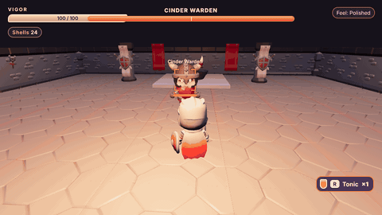
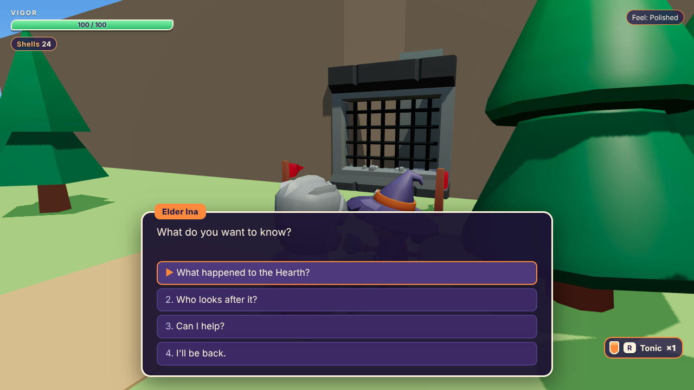
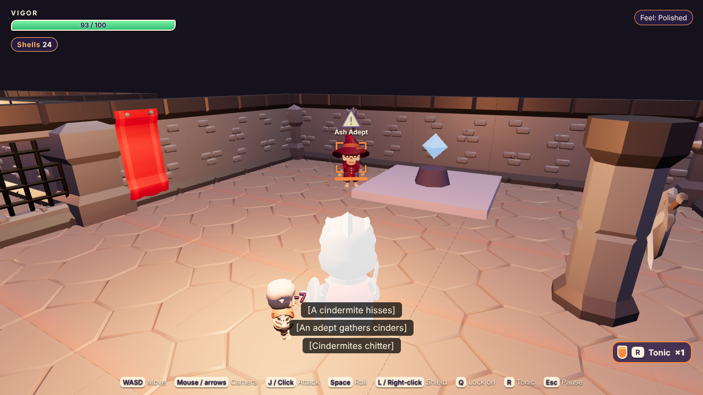
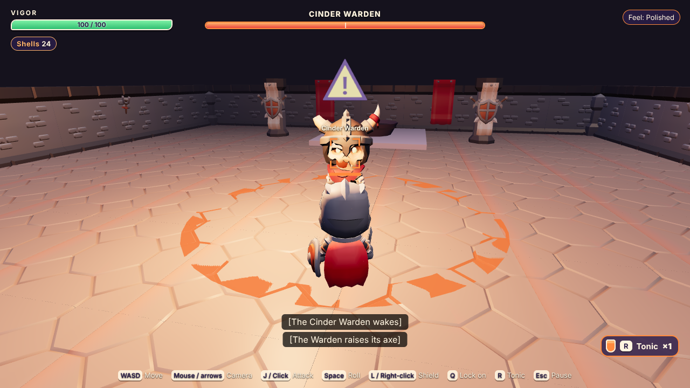
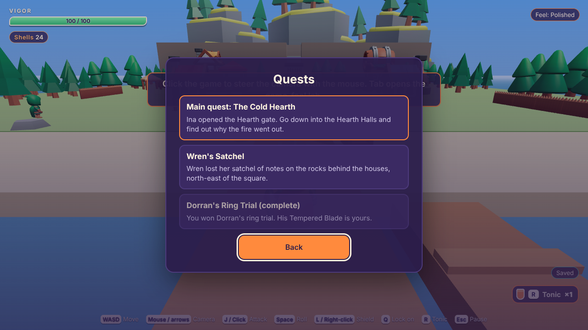
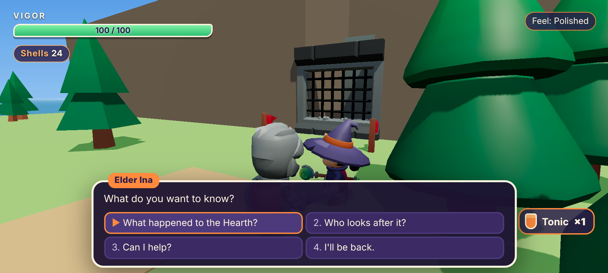
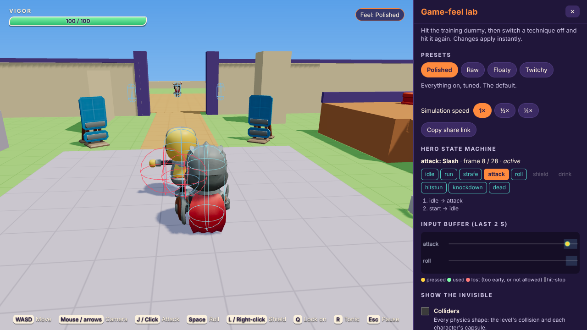

# Emberwake

A short 3D action-adventure in the browser: one island village, one
dungeon, a boss and an ending, about 10 to 15 minutes. You're Ren, a
courier who rows into Cinder Cove with a crate of lamp-stones that won't
light, because the Hearth that every ember wisp in the islands is born from
has gone cold. Built on Three.js and Rapier, in plain JavaScript.

Its other half is a **game-feel lab**: a panel beside the fight where you
switch individual techniques on and off (hit-stop, input buffering,
i-frames, camera smoothing, telegraphs...) and feel why each one exists.

**Play it:** <https://rdbagwell.github.io/3D_Game/> · add `?lab` to open the
lab straight away.



*Recorded from the real game with scripted inputs (`tools/record-gif.mjs`),
rendered in software in a headless browser.*

| | |
| --- | --- |
|  |  |
| Talking to Elder Ina in Cinder Cove | Locked on to an ash adept mid-cast in the Hearth Halls |
|  |  |
| The Cinder Warden winding up: the ring shows its reach | The quest log |

On a phone, held sideways: 

## The game-feel lab

**Start here if you're looking at this as a portfolio piece.** Open it from
the title screen (Game-feel lab), with **Tab** at any time, or with `?lab`.
Hit the training dummy, then press **Raw**: hit-stop, buffering, i-frames,
telegraphs, camera smoothing and every bit of feedback switch off at once,
and the same fight feels stiff, weightless and unfair. Then switch them back
one at a time. Presets can be shared as a link.

[docs/GAME-FEEL.md](docs/GAME-FEEL.md) explains every technique: the
problem it solves, exactly how it's done here (with frame-data diagrams),
and its trade-offs. The lab can also show the invisible: hitboxes and
hurtboxes, the state machine, the input buffer, the camera's collision
probe, colliders and a performance HUD.



## How to play

Talk to Elder Ina by the gate north of the square; she'll open the Hearth
Halls. Bram sells tonics at his forge, Wren on the shore has lost her
satchel, and Dorran at the training ring has a trial for you. Hearthstones
in the halls are checkpoints: fall, and you're back at the last one with
everything you had. The game saves by itself at hearthstones and whenever
you change area.

Every enemy attack is telegraphed: a ring on the ground closes on the enemy
(when it closes, the blow lands), a "!" sign grows above it, its weapon
glows, and a sound plays with a caption. Roll through the blow, block it
from the front, or step out of reach, then punish the recovery.

| Action | Keyboard and mouse | Gamepad (standard layout) | Touch |
| --- | --- | --- | --- |
| Move | WASD | Left stick / d-pad | Left thumb (the stick appears where you touch) |
| Camera | Mouse (click the game first) / arrow keys | Right stick | Drag on the right |
| Attack (press again to combo; pause before the third for a thrust; hold through a swing to charge) | J / left click | X / □ or RB / R1 | Attack |
| Roll | Space / K | B / ○ | Roll |
| Shield (raise it as a blow lands to parry; attack with it up to bash) | L / right click (hold, or toggle in Settings) | LB / L1 or LT / L2 | Shield |
| Lock on / switch target / recentre | Q / middle click; flick the camera to switch | RT / R2 or R3; flick the right stick | Lock |
| Talk, open, use | E | A / ✕ | Use |
| Drink a tonic (quick slot) | R | Y / △ | Tonic |
| Pause (quests, inventory, settings, save) | Esc / P | Menu / Options | II |
| Game-feel lab | Tab | View / Share | Lab |
| Performance HUD and colliders | F3 or \` | | |

Dialogue: E, J, Enter or a click continues; W/S, the arrows or the stick
move between choices (or press 1–4, or tap one). The Controls screen shows
the device you're using; keyboard keys can be rebound there.

**Settings** has audio, camera (sensitivity, inversion), controls (hold or
toggle for the shield and for lock-on, touch controls), accessibility and
difficulty (damage taken, slower enemies, auto lock-on, dialogue text
speed, reduced motion, captions, hints) and graphics quality (Low, Medium,
High; it picks a sensible one for your device).

### Why no XP or levels

You get stronger by finding things, not by grinding: Wren's Vigor Charm
(more health), Dorran's Tempered Blade (a stronger sword), and tonics. In a
short action game, getting better is the progression: learning the
telegraphs, the timing and the openings. Levels would let you out-stat a
fight instead of learning it, which works against what the game-feel lab is
there to show, and they'd make the boss's tuning (below) mean little.

## Island RPG, and then and now

Emberwake is the real-time counterpart of **Island RPG**
([RDBagwell/rpg](https://github.com/RDBagwell/rpg)). It's set in the same
islands (the ember wisps, the lamp-stones, Wren from Gull Isle), but stands
on its own. Its **dialogue system** (format, runner and validator),
**conditions and effects**, **quest format** and **save system** are ported
from the RPG, so a dialogue file moves between the two games; each ported
file says so. [docs/CONTENT.md](docs/CONTENT.md) lists the differences.

**Then and now.** The tag [`v1-original`](https://github.com/RDBagwell/3D_Game/tree/v1-original)
is the 2024 prototype this grew from: a character walking around Blender
test levels, with a hand-rolled game loop. Third-party models, textures and
sounds in it were removed or replaced with CC0 assets (see
[ASSETS.md](ASSETS.md)); Robert's own Blender files are kept in `art/`.

TODO(Robert): a note in your own words on what you built in 2024 and what
you'd say about the jump to this.

## Make your own content

Everything in the adventure is data in `src/game/data/`: areas, villagers,
dialogues, quests, items, the shop, objects, fights. Adding an NPC or a
quest never needs code. `npm test` checks all of it, including a search
proving every quest can still be finished from a new game. The guide is
[docs/CONTENT.md](docs/CONTENT.md).

**Levels in Blender:** name objects by the convention in
[docs/BLENDER.md](docs/BLENDER.md) (`collider_*`, `area_<surface>_*`,
`spawn_player_*`, `spawn_enemy_<type>_*`, `npc_<id>`, `object_<id>`,
`exit_<area>_<spawn>`, `trigger_<id>`), export as glTF, and the game builds
the colliders, footstep surfaces, spawns and exits from the names. The
village and the dungeon are built from data through that same path.

## Run it

You need [Node.js](https://nodejs.org/) 20.19 or newer.

```sh
npm install
npm run dev          # open the printed http://localhost:5173 link
```

| Command | What it does |
| --- | --- |
| `npm run dev` | Development server with live reload |
| `npm test` | Type check (`tsc --noEmit` over the JSDoc types), then the unit tests, including the content validator and headless playthroughs |
| `npm run validate` | Just the content checks |
| `npm run build` | Production build in `dist/` (relative paths: works in any folder) |
| `npm run preview` | Serve the last build |
| `npm run test:e2e` | Playwright smoke tests against the build (run `npm run build` first) |
| `npm run screenshots` | Regenerate `docs/screenshots/` (after `npm run build`) |
| `node tools/record-gif.mjs` | Regenerate the GIF above (after `npm run build`; needs ffmpeg) |
| `node tools/measure.mjs` | The performance report (after `npm run build`) |
| `npm run assets` | Optimise downloaded asset packs from `art/incoming/` into `public/` |

Music: drop `title`, `village`, `dungeon`, `boss` and `victory` `.ogg`
files into `public/music/` and they play (see [docs/AUDIO.md](docs/AUDIO.md));
until then the game is silent there, with no errors.

## Put it online (GitHub Pages)

`.github/workflows/pages.yml` tests and builds every push, and deploys
`main` to GitHub Pages. One-time setup: **Settings → Pages → Build and
deployment → Source: GitHub Actions**. The game is at
<https://rdbagwell.github.io/3D_Game/> (the repository name is
case-sensitive in that address). The build uses relative paths, so renaming
the repository only changes the address: update `repo` in `site.config.js`
and the links in this file (a test checks they agree).

## Performance

The budget: under 15 MB to download, 60 fps on a mid-range phone, at most
250 draw calls and 150,000 triangles a frame, and under 2 ms per
simulation step. Measured (in a headless browser, so sizes, draw calls,
triangles and CPU time are meaningful but frame rates are not):

| | Measured |
| --- | --- |
| Download | 8.93 MB, 3.06 MB gzipped (everything, before the title screen) |
| Busiest view | Village square on High: 149 draw calls, 104,491 triangles; a Hearth Halls fight: 140 draw calls, 128,523 triangles |
| Simulation | 0.28 ms per step on average, 0.70 ms at the 95th percentile |

Real-device numbers are still to be taken; [docs/PERFORMANCE.md](docs/PERFORMANCE.md)
has the full report, the two problems the measurement caught, and the steps
for measuring on a phone.

## What to look at (for reviewers)

- **The fixed-step loop** (`src/engine/loop/FixedStepLoop.js`): 60 Hz
  simulation, interpolated rendering, a catch-up cap. `tests/fixedStepLoop.test.js`
  runs the same fight at 30, 60 and 144 fps and gets identical results.
- **The player's state machine and frame data** (`src/game/player/Player.js`,
  `src/game/data/attacks.js`): an explicit transition table; every attack's
  startup, active and recovery frames, cancel windows and hitboxes are data.
- **The enemies' brains** (`src/game/enemies/`): one data-driven body with
  a melee brain, a caster brain and the boss's, all thinking without
  physics so they're tested with made-up perceptions; and a scripted player
  (`tests/helpers/bossBot.js`) that shows the boss is beatable on the
  Polished preset at every reaction timing tried and harder on Raw.
- **The game-feel lab** (`src/game/lab/`, `src/game/data/feel.js`,
  [docs/GAME-FEEL.md](docs/GAME-FEEL.md)).
- **The ported dialogue system and content validator**
  (`src/game/dialogue/`, `src/game/content/validateContent.js`): the RPG's
  format and checks, plus a reachability search over every state a player
  can reach.
- **The asset pipeline** (`tools/import-assets.mjs`): CC0 packs to
  meshopt-compressed glTF with unused animations stripped, every file
  accounted for in [ASSETS.md](ASSETS.md) and checked by a test.

## Project structure

```
index.html            page shell
site.config.js        where it's published (repository name, base path)
src/
  main.js             starts the Game
  engine/             reusable: loop, physics, levels, input, camera, audio, saves, debug (docs/ENGINE.md)
  game/
    data/             ALL content and tuning: areas, dialogues, quests, items, enemies, attacks, the lab's settings...
    adventure/        the game's rules: GameState, travel, checkpoints, conversations, quests, encounters
    sim/              Sandbox: the simulation of one area, one fixed step at a time (runs in Node)
    player/, enemies/, combat/   the hero, the enemies and their brains, hitboxes, lock-on
    dialogue/         the dialogue runner and validator (ported from Island RPG)
    content/          the content validator and reachability check; the credits
    world/            areas from data to scene graphs
    view/             rendering, animation, feedback
    ui/, lab/         HUD, menus, dialogue box; the game-feel lab
public/               files served as-is: optimised models, favicon, music (when added)
art/                  sources, not deployed: Robert's Blender files
tools/                asset import, measurement, GIF recording
tests/                Vitest unit tests; tests/e2e/ Playwright smoke tests and screenshots
docs/                 STORY, CONTENT, GAME-FEEL, ENGINE, BLENDER, AUDIO, PERFORMANCE, ASSETS-TODO, screenshots
```

Dependencies: `three` and `@dimforge/rapier3d-compat` at runtime; Vite,
Vitest, TypeScript (type checking only), `@types/three`, Playwright and
`@gltf-transform/cli` for development. All versions are pinned.

## Credits

- **Characters, village and dungeon:** [KayKit](https://kaylousberg.com)
  Adventurers, Skeletons, Prototype Bits, Dungeon Remastered and Medieval
  Hexagon by **Kay Lousberg**, CC0. Thank you!
- **Game, code, synthesised sound, levels and story:** Robert Bagwell, with
  Claude. The dialogue and save systems come from Island RPG.

The in-game credits are generated from [ASSETS.md](ASSETS.md), which lists
every file, its source and its licence.
