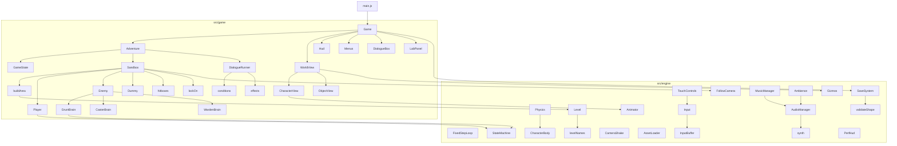

# The engine

This is a guide to the code in `src/engine/` and how the game in
`src/game/` sits on it. It's written for Robert, who owns the engine, and
for anyone building the game on top of it. It mirrors Island RPG's
`docs/ENGINE.md`: same rules, same layout, a 3D engine instead of a 2D one.

The engine is plain JavaScript (ES modules) with JSDoc types checked by
`tsc --noEmit` (`npm run typecheck`). It uses Three.js for drawing and
Rapier (`@dimforge/rapier3d-compat`) for collision. Every module is a short
file with a comment at the top saying what it does and why. When this
document and the code disagree, the code wins; please fix the document.

## The rule: engine and game stay separate

```
src/
  engine/   reusable: loop, physics, input, camera, audio, assets, debug... never about knights or grunts
  game/     this game: uses the engine, owns every game rule
  main.js   creates the Game and starts it
```

`src/engine/` never imports from `src/game/`, and `tests/boundary.test.js`
checks it. A second rule keeps the simulation testable: `game/sim`,
`game/player`, `game/enemies` and `game/combat` never import the view, the
UI or the lab, so the whole fight runs in Node.

## Module map



| Folder | What's in it |
| --- | --- |
| `engine/loop/` | `FixedStepLoop`: 60 Hz simulation, interpolated rendering, catch-up cap, pause when hidden, slow motion |
| `engine/core/` | `StateMachine` (explicit transitions), `EventBus`, `Rng` (seeded), `math.js` (frame-rate independent smoothing), `storage.js` |
| `engine/physics/` | `Physics` (Rapier world, ray and sphere casts), `CharacterBody` (kinematic character controller) |
| `engine/level/` | `Level` (scene graph → colliders, surfaces, spawns, triggers), `levelNames.js` (the Blender naming convention) |
| `engine/input/` | `Input` (actions over keyboard, mouse, gamepads, touch), `InputBuffer`, `TouchControls` |
| `engine/camera/` | `FollowCamera` (orbit, smoothing, look-ahead, collision, lock-on framing, recentre), `CameraShake` |
| `engine/assets/` | `AssetLoader` (meshopt glTF with real progress), `Animator` (one mixer, cross-fades) |
| `engine/audio/` | `AudioManager` (synthesised, positional sound effects), `MusicManager` (cross-fading tracks), `Ambience` (looping beds per place), `synth.js` |
| `engine/save/` | `SaveSystem` (versioned saves with migrations, corrupt-save handling) and `validateShape`, ported from Island RPG |
| `engine/debug/` | `Gizmos` (debug lines in one draw call), `PerfHud` |
| `game/sim/` | `Sandbox`: the whole simulation of one area, one `step(inputFrame)` at a time: player, enemies, projectiles, NPCs, objects, exits |
| `game/adventure/` | `Adventure` (the game's rules on top of the sandbox: travel, checkpoints, conversations, quests, encounters), `GameState`, ported `conditions` and `effects` |
| `game/dialogue/` | `DialogueRunner` and `validateDialogue`, ported from Island RPG |
| `game/content/` | The content validator with its reachability search; the credits read from ASSETS.md |
| `game/world/` | `buildArea`: an area's data → a scene graph with the Blender names |
| `game/player/`, `game/enemies/`, `game/combat/` | The hero's state machine; `Enemy` with its brains (melee, caster, the Warden); the dummy; hitboxes; lock-on |
| `game/view/` | `WorldView` (renderer, a scene per area, lights, quality, feedback), `CharacterView` (models, animation, flashes, telegraphs), `ObjectView` (gates, chests, switches...), `Effects`, `models.js` |
| `game/ui/`, `game/lab/` | HUD, menus (title, slots, pause, quests, inventory, shop, settings, credits), the dialogue box, the game-feel lab panel |
| `game/data/` | All tuning and content: attacks and projectiles (frame data), actors, areas, NPCs, objects, dialogues, quests, items, shops, encounters, events, flags, sounds and ambience, graphics presets, the asset manifest. See [CONTENT.md](CONTENT.md) |

## The game loop

`FixedStepLoop` calls **update** at a fixed 60 Hz and **render** once per
screen refresh, exactly like Island RPG's loop:

```
every animation frame:
  frameTime = time since last frame
  accumulator += frameTime × timeScale         (timeScale < 1 = the lab's slow motion)
  while accumulator ≥ 1/60 and fewer than 5 updates this frame:
      update(1/60)                              ← input, simulation, physics, camera
      accumulator −= 1/60
  if 5 updates ran and time is still owed: drop it (the spiral-of-death guard)
  render(alpha = accumulator / (1/60))          ← draw between the last two states
```

**Why fixed?** Frame data only means something if a frame is always 1/60 s,
physics is only repeatable with a constant step, and the same inputs must
give the same fight on a 30 Hz phone and a 144 Hz monitor.
`tests/fixedStepLoop.test.js` runs the real game at 30, 60, 144 fps and with
uneven frame times and checks that the results are identical to the last
bit.

**Why interpolate?** At 144 Hz most frames run no update at all; drawing
the last state would make motion stutter. Each actor keeps its previous
position (`Sandbox.prev`), the camera keeps its previous pivot and
position, and the view draws `previous + (current − previous) × alpha`.

**The spiral of death.** If updates fall behind (a slow phone, a debugger
pause), each frame owes more updates, which take longer, and the game
freezes. At most 5 updates run per frame; anything still owed is dropped
and counted in `loop.droppedTime`. The game slows down instead of locking
up.

**Hidden tabs.** `loop.pauseWhenHidden(document)`: no updates in the
background, and the time away is forgotten on return.

## The simulation and the view

`Sandbox` (in `game/sim/`) owns the physics world, the level, the player,
the enemies, the camera's simulated state, lock-on and combat. One update:

1. record presses in the input buffer
2. remember positions (for interpolation)
3. if hit-stop is running: count it down, move only the camera, stop here
4. lock-on: acquire, release, switch, break
5. player, then enemies, decide and move (character controller)
6. `physics.step()`
7. hitboxes against hurtboxes: hits, blocks, dodges, hit-stop
8. camera, triggers, respawns

It never draws or plays sound. It **emits events** (`hit`, `block`,
`dodge`, `swing`, `roll`, `footstep`, `windup`, `lockOn`...) and
`WorldView` turns them into flashes, sparks, shake, sound and rumble.
That split is what lets `tests/` run whole fights in Node.

## Physics: the character controller

Characters are Rapier **kinematic** bodies moved by Rapier's character
controller (`CharacterBody`), not dynamic bodies pushed with velocities.
Each update the game decides the movement it wants; the controller returns
the movement that's allowed: it walks up slopes (≤ 46°), climbs steps
(≤ 0.35 m), snaps to the ground going down, and slides along walls. Gravity
is a vertical speed the body keeps itself. There are no dynamic bodies at
all, so the physics is cheap and repeatable.

Rapier is used for movement and for the camera's collision probe
(`physics.sphereCast`). Hitboxes and hurtboxes are plain spheres and
capsules in `game/combat/hitboxes.js`: checked once per update in a known
order, no extra bodies to keep in sync with animations, and trivial to test.

## Levels and areas

`Level.fromScene(root, physics)` turns a scene graph into colliders,
footstep surfaces, spawns, triggers, exits, and where NPCs, objects and
markers stand, using the Blender naming convention. The guide is
[BLENDER.md](BLENDER.md).

The adventure's areas are data (`src/game/data/areas/`). `buildArea()`
turns one into a scene graph with those same names, so the game reads it
exactly as it would read a Blender export. One area is simulated at a time:
walking into an `exit_` box makes the Adventure ask the Game to travel; the
Game fades out, the Adventure builds the next area's Sandbox (a fresh
physics world), the WorldView swaps in a new scene, and the Game fades back
in. Neighbouring areas are built and their shaders compiled in idle time
beforehand, so the swap is quick.

## The adventure layer

`Adventure` (`src/game/adventure/`) sits between the Game and the Sandbox.
It owns the `GameState` (flags, items, shells, checkpoint, quest progress)
and turns sandbox events into progress: exits, hearthstones, Interact on an
NPC or object (a dialogue), switches struck, enemies beaten, tonics drunk,
falling. It runs headless, so `tests/adventure.test.js` plays the story from
the dock to the ending in Node.

## Input

Game code asks about **actions**, never keys, the same as Island RPG:

```js
const frame = input.sample(dt);           // once per update
if (button(frame, 'attack').pressed) ...
frame.move   // { x, y } -1..1, y = forward (keys, left stick or touch stick)
frame.look   // { x, y } radians to turn the camera this update
```

Bindings map actions to `'key:KeyJ'`, `'mouse:0'`, `'btn:2'` (standard
gamepad mapping) and `'axis:1-'`. The defaults are in `src/game/config.js`;
players remap keyboard keys in **Settings → Controls**, saved in
`localStorage` (`src/game/settings.js`). Any gamepad with the browser's
standard mapping works; the HUD names its buttons (A/B/X/Y, ✕/○/□/△ or the
Switch layout) from the pad's id.

**Touch:** `TouchControls` adds a floating stick (it appears under the left
thumb), camera drag on the right, and thumb-sized buttons. It drives the same
actions. The stick and the drag read fingers from the canvas itself and
ignore the mouse, so nothing invisible ever sits over the game. The controls
follow the pointer actually in use (`Game.listen`): they start on for phones
and tablets, come up as soon as a finger touches a touchscreen laptop, and go
away again when the mouse is used. Settings → touch controls On / Off
overrides that.

**The input buffer** (`InputBuffer`) remembers attack and roll presses for
a few frames so an early press still counts when the action becomes
possible. See [GAME-FEEL.md](GAME-FEEL.md).

## Camera

`FollowCamera` orbits a pivot near the player's chest. Smoothing, look-ahead,
collision avoidance and lock-on framing are each a setting (the lab's Camera
section). Collision sweeps a sphere from the player's head towards where the
camera wants to be and stops short of anything solid; it pulls in instantly
and eases back out. `CameraShake` adds shake and hit nudges only when
drawing, never to the simulated camera, so they can't affect aiming; it is
capped and off with reduced motion.

## Assets and animation

`AssetLoader` loads meshopt-compressed glTFs (made by `npm run assets`)
with a byte-accurate progress bar: the manifest (`src/game/data/assets.js`)
lists each file's size, and `tests/assetManifest.test.js` keeps those sizes
honest. A file that fails to load becomes a placeholder shape.

`Animator` wraps one `AnimationMixer` per character: `play(name, { fade,
duration, loop })` cross-fades from the current clip, and `duration`
stretches a clip to match an attack's frame data.

## Audio

All sound effects are synthesised (`game/data/sounds.js`), so the game
ships no audio files. `AudioManager.play(name, { position })` goes through
an HRTF panner when positional sound is on; the listener follows the camera.
Cues that matter for gameplay carry a caption. `Ambience` loops a bed per
area. `MusicManager.play(name)` cross-fades to `music/<name>.ogg` if that
file exists (the build lists `public/music/`), and plays silence otherwise.
[AUDIO.md](AUDIO.md) has the track names.

## Saves

`SaveSystem` (ported from Island RPG) keeps one versioned JSON record per
slot in `localStorage`, upgrades old versions through `MIGRATIONS`,
validates what it loads (`validateShape`), and reports a damaged save
instead of throwing (a copy is kept under `<key>:<slot>:corrupt`). If
storage is blocked it keeps saves in memory for the session.
`src/game/saves.js` is the game's format and its history.

## Debugging

- **Tab** opens the game-feel lab, which can show colliders, hitboxes,
  hurtboxes, the camera probe, the state machine, the input buffer and a
  performance HUD.
- **F3** or **`** toggles the performance HUD and colliders together.
- `window.game` is the running game in the browser console:
  `game.sandbox.player.state`, `game.sandbox.step(frame)`, `game.feel`.

---

## How to…

### …add an attack

Add it to `ATTACKS` in `src/game/data/attacks.js` (the header explains every
field), then point a combo step's `next` at it. Run `npm test`: the frame
data test checks it's well formed.

### …add an enemy type

1. Numbers in `ENEMIES` (`src/game/data/actors.js`), with `brain: 'melee'`,
   `'caster'` or `'warden'`. A new melee enemy needs nothing else (the
   cindermite is only data).
2. If it thinks differently, a brain like `CasterBrain` with its own
   transition table, added to `BRAINS` in `enemies/Enemy.js`. Test it with
   made-up perceptions, like `tests/enemies.test.js`.
3. A model in `makeFoe` (`view/models.js`).
4. Place it with `spawn_enemy_<type>_<name>`, or in an encounter's waves.

### …add a game-feel technique to the lab

1. Add a setting to `FEEL_SETTINGS` (`src/game/data/feel.js`) with its
   "What this does" sentence, and its "off" value to the Raw preset.
2. Read it where it applies (`ctx.feel.<id>` in the simulation, or
   `this.feel()` in `WorldView` for feedback). Read it every time it's
   used, so changes apply mid-fight.
3. The lab panel, saving, sharing and validation pick it up automatically.
4. Document it in [GAME-FEEL.md](GAME-FEEL.md).

---

## Known limitations

- **No jump.** The action list has none; coyote time is applied to the roll.
- **Root motion isn't used.** Movement is code-driven (KayKit's clips are
  in place), so the lab has no root-motion switch.
- **One area at a time.** Areas are separate scenes and physics worlds,
  joined by fades, not one streamed world.
- **Hit-stop freezes the whole fight**, not just the two fighters. With
  one fight on screen that reads the same and is simpler.
- **Type checking covers `src/` only**, as in Island RPG.
